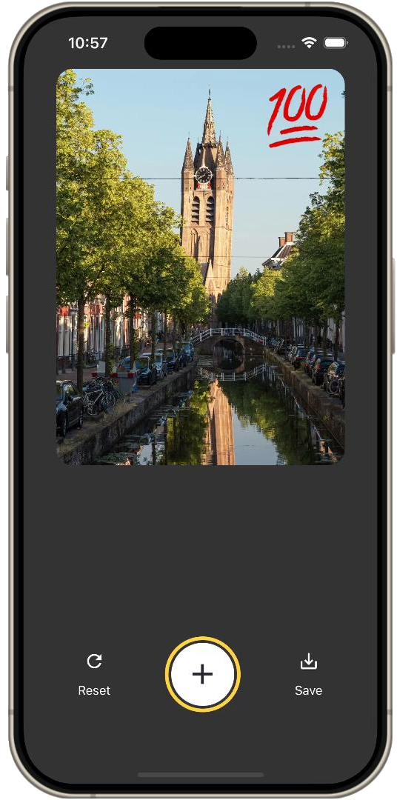

# Sticker Smash App

A simple app to add stickers to your images and download them. Built with React Native and Expo.



## Features

- **Image Selection**: Load images from your device's gallery.
- **Sticker Smash**: Add stickers to your images with ease.
- **Save Image**: Save edited images directly to your device.

## Installation Instructions

1. [Download](https://github.com/luiisca/sticker-smash/releases/download/v1.0/sticker-smash.apk) the APK file.
2. Install the APK on your Android device by enabling installation from unknown sources if necessary.
3. Open the app and start slapping stickers on any images!

## Getting Started

1. Clone the repo
   ```sh
    git clone https://github.com/luiisca/sticker-smash.git
   ```
2. Install dependencies
   ```sh
   cd sticker-smash
   npm install
   ```
3. Start the Expo development server
   ```sh
   npm run start
   ```
4. Open the Expo Go app on your Android or iOS device and scan the QR code provided by the development server.
